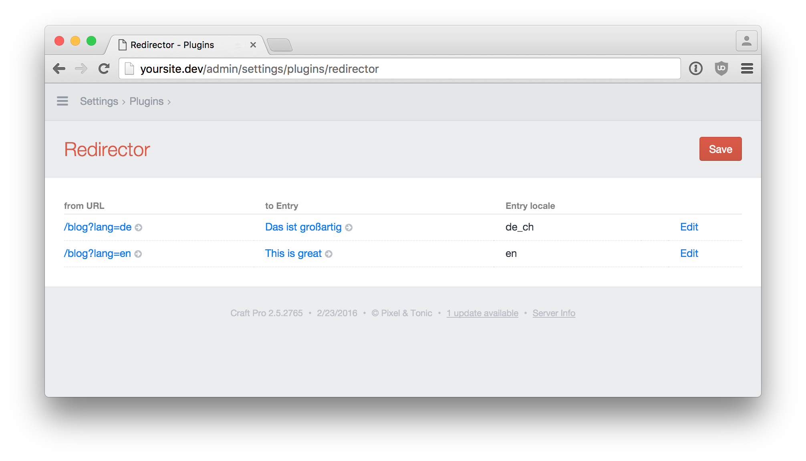
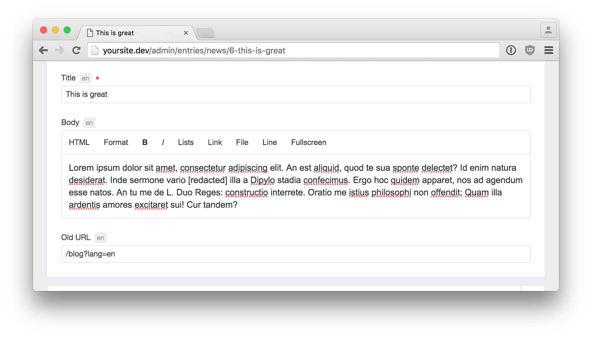

# Redirector: Redirects for Craft CMS

This is a redirect solution that is best suited if you want to

* empower your content editors to add legacy URLs right to the entries they should redirect to
* use legacy URLs in your templates. A common use case is to preserve the share count of social widget (e.g. facebook like) after an URL change.

## Usage

* Add a field of the type "Legacy URL" to an entry type
* Edit an entry of that type and fill the field with a path that does not exists (e.g. `/blog/page?lang=de`)
* Visit `/blog/page?lang=de` in your browser and you will be redirected to the entry's url

## How does it work
* The plugin adds a new field type "Legacy URL" to collect redirect instruction throughout the site
* When a page is loaded that would result in a 404-"page not found" error, the plugin looks up if a redirection exists and redirects if it does

## Some details
* The lookup data is kept in its own table so lookups should fast
* Also the lookup is only triggered for non existing pages (404s) so they should be rare
* The plugin is locale aware
* You can few all existing redirections in one place on the plugins settings page

